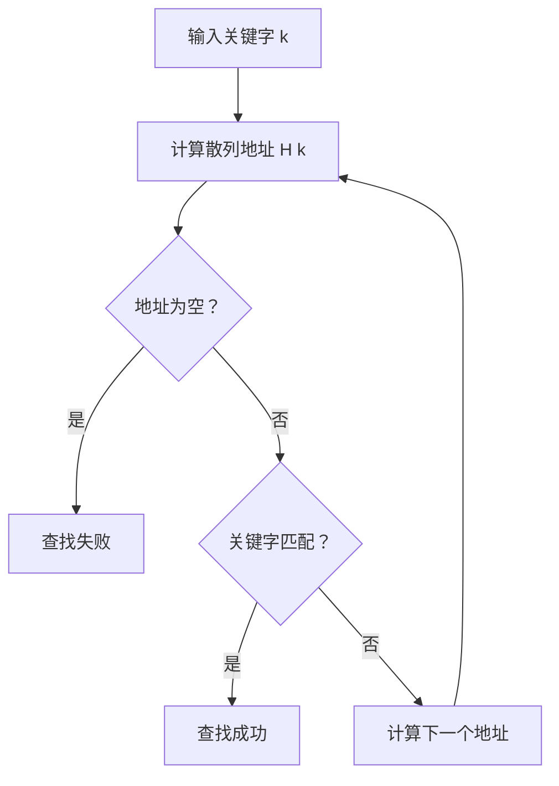

# 学习目标
- [ ] 
- [ ]    

散列表（**哈希表**）是一种基于散列函数（**哈希函数**）实现的高效数据结构，能够**通过关键字快速定位对应的存储位置，从而实现快速查找**；散列表查找的核心是利用散列函数将关键字映射到散列表的一个索引位置，然后根据该位置判断是否找到目标元素
# 一、散列表的基本概念

- 散列方法(杂凑法)
	选取转换函数，依该函数按关键字计算元素的存储位置并按此存放;
	查找时，由同一个函数对给定值k计算地址，将k与地址单元中元素关键码进行比，确定查找是否成功
- 散列函数(杂凑函数):散列方法中使用的转换函数
$$H(key) = K$$
- 散列表：按照散列方法构造的散列表
- 冲突：不同的关键码映射到同一个散列地址上
$$key1≠key2, \ but \  H(key1)=H(key2)$$

假设有一组关键字序列：
```txt
{12, 15, 16, 22, 25, 29, 34, 37, 47, 48, 56, 67}
```
散列表长度为 13，散列函数采用除留余数法：
$$H(key) = key \ mod\ 13$$
>在这里，mod为取模运算，在散列表的构造里经常使用

可以看到，不同的关键字（如12和25，16和29，34和47，15和67）被映射到了相同的散列地址，发生了冲突

- 同义词：具有相同函数值的多个关键字
# 二、散列表的构造
使用散列表要解决两个问题：
1. 构造好的散列函数：
	- 所选函数尽可能简单，以便提高转换速度
	- 所选函数对关键码计算出的地址，散列地址集中均匀分布减少空间浪费
2. 指定一个好的解决冲突的方案：
	- 查找时，如果散列函数计算出的地址中查不到关键码，则应当依据解决冲突的规则，有规律地查询其他相关单元
## 1.散列函数的构造
我们要根据元素集合的特性来构造：
- 要求一：n个数据源仅占用n个地址，虽然**散列查找是以空间换时间**，但仍希望散列的地址空间尽量小
- 无论用什么方法存储，目的都是尽量**均匀地存放元素**，避免冲突

按照上面的原则，我们制定了如下几个构造方法：

| 构造方法      | 原理                                                                       | 优点                          | 缺点                  | 适用场景                      |
| :-------- | :----------------------------------------------------------------------- | :-------------------------- | :------------------ | :------------------------ |
| **直接定址法** | 取关键字或其线性函数值为散列地址，如 $\text{Hash}(key) = a \times key + b$                 | 简单、计算方便，不会产生冲突              | 要连续占用地址空间，浪费存储空间    | 关键字范围较小且连续的情况             |
| 数字分析法     | 分析关键字，提取分布均匀的若干位数字拼接为散列地址                                                | 能较好避免冲突，地址分布均匀              | 需预先知道关键字分布，提取位数选择复杂 | 关键字位数较多且分布规律明显的情况         |
| 平方取中法     | 取关键字平方后的中间几位作为散列地址                                                       | 散列地址与关键字的每一位都相关，随机性好，冲突概率较低 | 计算相对复杂，特殊关键字可能影响效果  | 关键字范围较广且无明显规律的情况          |
| 折叠法       | 将关键字分割成若干部分，叠加合并后得到散列地址                                                  | 简单易行，充分利用关键字的每一位信息          | 分割方式不合理可能导致地址分布不均匀  | 关键字位数较多且无明显规律的情况          |
| **除留余数法** | 取关键字对某个数（通常是质数）取模的结果作为散列地址，如 $\text{Hash}(key) = key \mod p$(p<=m,且p为质数) | 方法简单，散列地址分布均匀，冲突概率低         | 若模数选择不当，冲突概率会增加     | 关键字范围较大且无明显规律的情况，模数通常选择质数 |
| 随机数法      | 选择一个随机函数，以关键字作为种子值，通过随机函数生成散列地址                                          | 散列地址随机性好，冲突概率低              | 随机函数的选择和实现较为复杂      | 对散列地址随机性要求较高的情况           |
## 2.处理冲突的方法
散列函数构造地再好，在数据量较大的情况下，也总会出现冲突；我们有两种常见的解决冲突的方法
### (1)开放地址法
基本思想：有冲突时就去寻找下一个空的散列地址，只要散列表足够大，空的散列地址总能找到，并将数据元素存入
例如，在出留余数法中，我们重新构建构造函数来寻找新的地址，方法有以下几种：
- **线性探测法**  
    探测序列为当前位置向后依次递增一个单位：  
    $$fi(key)=(h(key)+i) modm,\ i=0,1,2,…,m−1 $$
    优点：实现简单，空间利用率高，连续存储有利于缓存性能
    缺点：容易产生“初级聚集”，即冲突元素聚集在一起，导致探测次数增加，影响性能  
    适用场景：负载因子较低，插入删除不频繁的情况
    
- **二次探测法**  
    探测序列以平方步长跳跃，减少聚集：  
    $$fi(key)=(h(key)±i^2)  \ mod\ m,\ i=0,1,2,…,m−1$$
    优点：缓解了线性探测的聚集问题。  
    缺点：不能保证探测到所有位置，可能导致“辅助聚集”
    
- **双重散列法（再哈希法）**  
    使用两个不同的散列函数，第二个函数决定探测步长：  
    $$fi(key)=(h1(key)+i×h2(key))  modm $$ 
    优点：减少聚集，探测序列更分散，性能较好  
    缺点：计算复杂度较高，实现较复杂
- **随机探测法**
    当发生冲突时，通过伪随机数生成器生成一个随机序列，以确定下一个探测位置，直到找到空闲位置或找到目标元素
   $$fi(key)=(h(key)+d_i)modm$$
   
   
   
#### 举例
关键码集：{47, 29, 11, 16, 92, 22, 8, 3}，散列表长度：m = 11，散列函数：Hash(key) = key mod 11，采用线性探测法完成散列表的构建
*构建过程*：
1. 47、7、11、16、92均是由散列函数得到的没有冲突的散列地址，分别为3、7、0、5、4
2. Hash(29) = 7，散列地址有冲突，需寻找下一个空的散列地址；由$H_1=(Hash(29)+1) \ mod \ 11 =8$，散列地址8为空，因此将29存入
3. 其余数字，如22、8、3同样由$H_1$解决冲突

平均查找长度：ASL=(1+2+1+1+1+4+1+2+2)/9 = 1.67
    
### (2)链地址法 
链地址法是一种常用且简单的散列冲突解决方法，其核心思想是在散列表的每个槽中维护一个链表（通常是单链表），所有映射到同一散列地址的元素都存放在该链表中
    
构造过程：
- 散列函数计算关键字的散列地址 h(key)h(key)
- 散列表中对应地址的槽位存储一个链表的头指针
- 当多个关键字映射到同一地址时，这些关键字对应的元素依次插入该链表
- 查找、插入和删除操作都在链表中进行：
    - 查找时先定位散列地址对应的链表头，再遍历链表寻找目标元素
    - 插入时通常将新元素插入链表头部或尾部
    - 删除时在链表中找到元素并移除

#### 举例
有一组关键字为：{19、14、23、1、68、20、84、27、55、11、10、79}，散列函数为Hash(key) = key mod 13
我们根据链地址法就能构造出如下散列表：
![[Pasted image 20250610195318.png|600]]
#### 优缺点
- 优点：
	- 非同义词不会冲突，无聚集现象
	- 链表上结点空间动态申请，更适合表厂不确定的情况

# 三、散列表的查找算法
## 1.算法步骤
散列表的查找算法步骤如下：
1. **计算散列地址**  
    使用散列函数 h(key)h(key) 将待查找的关键字 key 转换为散列表中的索引地址该函数通常是将 key 映射到一个固定范围内的整数
2. **访问散列表对应位置**  
    根据散列地址直接访问散列表中对应的位置。
3. **判断查找结果**
    - 如果该位置为空，说明关键字不存在，查找失败   
    - 如果该位置的关键字与查找关键字相同，查找成功，返回该位置的元素
    - 如果该位置的关键字不同，说明发生了冲突，需要根据冲突解决方法继续查找
4. **冲突处理查找**
    - **链地址法**：访问该位置的链表，遍历链表查找目标关键字
    - **开放定址法**（如线性探测、二次探测、双重散列）：根据探测序列依次访问其他位置，直到找到关键字或遇到空槽 
5. **返回查找结果**  
    找到关键字则返回对应元素，否则返回查找失败信息


## 2.效率分析
对于关键字集(19、14、23、1、68、20、84、27、55、11、10、79)，关键字个数n=12
*问*：
- 无序查找ASL?
$$ASL=\frac{12+1}{2}$$
- 有序表折半查找ASL？
$$ASL=log_2(12+1)-1$$
- 散列表查找ASL?
    理论上，如果散列表完全没有冲突时，ASL可以为1，但是一般情况下一定会有冲突，其值不是严格的O(1),也不是O(n)
### 散列表的平均查找长度
对于散列表的ASL，取决于：
- 散列函数
- 处理冲突的方法：开放地址法、链地址法
- 散列表的**填装因子**$\alpha$；其值越大，说明表中记录越多，发生冲突的可能性就越大，查找时比较的次数就越多
    $$\alpha=\frac{表中填入的记录数}{散列表的长度}$$
- 对于不同的探测方法，探测因子也不同：
$$\begin{align*}
\text{ASL}_{\text{拉链法}} &\approx 1 + \frac{\alpha}{2} \\[1.5ex]
\text{ASL}_{\text{线性探测法}} &\approx \frac{1}{2} \left( 1 + \frac{1}{1-\alpha} \right) \\[1.5ex]
\text{ASL}_{\text{随机探测法}} &\approx -\frac{1}{\alpha} \ln(1-\alpha)
\end{align*}
$$

# 四、几点总结
- 散列表具有很好的平均性能，由于一些传统的技术
- 链地址法由于开地址法
- 除留余数法作散列函数优于其他类型的函数